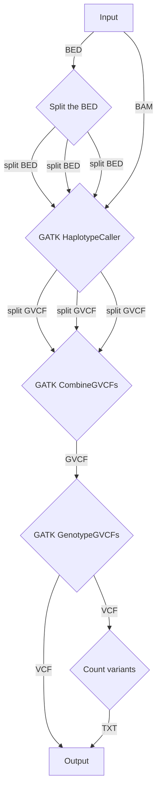

# Genomics example project

The genomics project example will consist of a simple variant calling flow based on the [GATK best-practice guidelines](https://gatk.broadinstitute.org/hc/en-us/articles/360035535932-Germline-short-variant-discovery-SNPs-Indels). The following diagram shows the expected flow for this example. Explanations for each step are added below the diagram. Take note that this diagram is a simplification of the real flow and some inputs have been excluded. You should still add these where needed.

Input: The input of the pipeline can be determined by the student, but should provide a way to pass to all inputs to the pipeline: BAM and BAI files per sample, one BED file containing the variant calling regions and additional reference files needed. All data is available in the [data/](./data/) directory.

The data in the input directory has been fetched from the `modules` branch of the [nf-core test-datasets repository](https://github.com/nf-core/test-datasets/tree/modules). The data comes from publicly available human genomes and should run pretty fast using the proposed flow. The data contains only a subset of the human genome.

1. Split the BED file into a couple of small BED files to parallelize the variant calling later on. You can use an existing tool or write your own script to do this. The amount of BED files created should be customizable.
2. Call each region on the input BAM files using [GATK HaplotypeCaller](https://gatk.broadinstitute.org/hc/en-us/articles/360037225632-HaplotypeCaller). Make sure the tool outputs GVCF files as these are needed finish the pipeline successfully.
3. Merge the resulting GVCFs using [GATK CombineGVCFs](https://gatk.broadinstitute.org/hc/en-us/articles/360037593911-CombineGVCFs). Make sure that only GVCFs coming from the same BAM file are merged together here.
4. Genotype the merged GVCFs using [GATK GenotypeGVCFs](https://gatk.broadinstitute.org/hc/en-us/articles/360037057852-GenotypeGVCFs) and publish the resulting VCFs to the output directory per sample.
5. Write a custom script (Do not use an existing tool here!) to count the variants detected in each sample. Print the results to an easy to parse file format (CSV, TSV, YAML...). Publish this file to the output directory per sample.

## Attention points

1. Watch out for pipeline bottlenecks (e.g. an operator that waits to resolve until all samples have reached that point of the pipeline)
2. Make sure all [requirements](../../README.md) are met. Feel free to add more things to this pipeline to reach that goal.